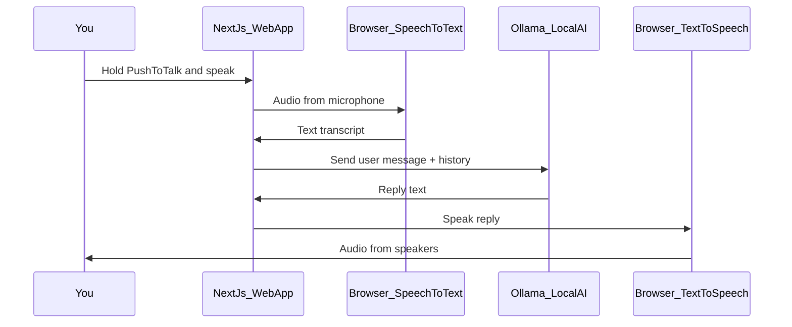

# Phase 1: Free Voice Support (Beginner Plan)

> Saved plan for the Voice Customer Support System — Phase 1 MVP  
> Requirements: see [prompt.md](./prompt.md)

## Overview

Build a free, local Phase 1 voice support demo: a Next.js web page where you hold a button to talk (push-to-talk), your words are understood by the browser, a free local AI (Ollama) writes the reply, and the browser speaks it through your PC speakers. No paid API keys required.

---

## What you are building (plain English)

Imagine a small website on your computer that works like a simple phone call with a support bot:

1. You **hold a button** and speak into your mic.
2. The **browser** turns your voice into text (like live captions).
3. A **small AI program on your Mac** (Ollama) reads that text and writes a helpful reply.
4. The **browser** reads the reply out loud through your speakers.

You do **not** need OpenAI, Vapi, or a credit card for Phase 1. Everything is free.



---

## Why these three pieces (and what they mean)

| Piece | Name | What it does | Cost | Where it runs |
|-------|------|--------------|------|----------------|
| **STT** | Speech-to-Text | Ears: voice → words | Free | Chrome/Edge (built-in Web Speech API) |
| **LLM** | Large Language Model | Brain: thinks and writes reply | Free | Your Mac via [Ollama](https://ollama.com) |
| **TTS** | Text-to-Speech | Mouth: words → voice | Free | Browser (built-in `speechSynthesis`) |

**STT** and **TTS** use features already inside Chrome — no API key.

**Ollama** is a free app you install once. It downloads an open-source model (we will use a small one like `llama3.2` or `qwen2.5:1.5b`) and exposes a local URL: `http://localhost:11434`.

**Push-to-talk** (your choice): you hold "Talk" while speaking, then release. This avoids tricky "when did they stop talking?" logic.

---

## Tech stack (locked for Phase 1)

- **Framework**: [Next.js](https://nextjs.org) + TypeScript (as in [prompt.md](./prompt.md))
- **UI**: React components — status, transcript, talk button, start/stop
- **Mic**: `navigator.mediaDevices.getUserMedia()` (permission prompt)
- **STT**: `window.SpeechRecognition` / `webkitSpeechRecognition` (Chrome/Edge only)
- **LLM**: Ollama HTTP API via Next.js route `POST /api/chat`
- **TTS**: `window.speechSynthesis.speak()`
- **Run locally**: `npm run dev` → open `http://localhost:3000`

**Browser requirement**: Use **Chrome or Edge**. Safari/Firefox have weak or no support for speech recognition.

---

## Project layout (what files we will create)

```
Voice Customer Support System/
├── prompt.md                    # (existing) your requirements
├── phase-1-plan.md              # (this file) implementation plan
├── README.md                    # step-by-step setup for beginners
├── .env.example                 # optional: OLLAMA_MODEL=llama3.2
├── package.json
├── app/
│   ├── layout.tsx
│   ├── page.tsx                 # main screen
│   ├── globals.css
│   └── api/
│       └── chat/
│           └── route.ts         # talks to Ollama on localhost:11434
├── components/
│   ├── StatusBar.tsx            # Idle | Listening | Thinking | Speaking
│   ├── TranscriptPanel.tsx      # "You said" / "Agent replied"
│   └── PushToTalkButton.tsx     # hold to record
├── hooks/
│   └── useVoiceSession.ts       # orchestrates STT → chat → TTS
└── lib/
    ├── speechRecognition.ts     # browser STT wrapper
    ├── speechSynthesis.ts       # browser TTS wrapper
    └── ollama.ts                # call local Ollama API
```

---

## Screen behavior (from your prompt)

| UI part | Behavior |
|---------|----------|
| Title | "Voice Support (Phase 1)" |
| Status | Shows: Idle → Listening (hold button) → Thinking → Speaking → back to Idle |
| Transcript | Two boxes: what you said, what the agent replied |
| Start/Stop | Starts session (mic permission); Stop ends session |
| Push-to-talk | **Hold** to speak; **release** to send to AI |
| Errors | Mic denied, no speech, Ollama not running — each gets a clear message |

**Conversation memory**: last ~10 turns kept in browser memory until you click "New conversation".

**LLM system prompt** (short, for spoken replies):

- 1–3 sentences only, no bullet lists
- Friendly support tone
- Demo mode: no real order lookup yet

---

## Setup steps (what you will do once)

### Step A — Install tools (one time)

1. **Node.js 18+** — runs the web app (`node -v` in Terminal)
2. **Ollama** — download from https://ollama.com/download (Mac)
3. **Chrome or Edge** — for microphone + speech recognition

### Step B — Download the AI model (one time)

In Terminal:

```bash
ollama pull llama3.2
```

If your Mac is older or has less RAM (~8GB), use a smaller model instead:

```bash
ollama pull qwen2.5:1.5b
```

### Step C — Run the project (every time you test)

Terminal 1 — keep Ollama running (often auto-starts after install):

```bash
ollama serve
```

Terminal 2 — the web app:

```bash
cd "Voice Customer Support System"
npm install
npm run dev
```

Open **http://localhost:3000** in Chrome → allow microphone → hold Talk → speak → release → wait → hear reply.

---

## How each API route / hook works

### `useVoiceSession` hook (the conductor)

The **conductor** of the whole flow — connects mic, speech-to-text, AI, and text-to-speech in order.

1. On **pointerdown** (push-to-talk): set status `Listening`, start `SpeechRecognition`
2. On **pointerup**: stop recognition, set status `Thinking`
3. POST transcript to `/api/chat` with message history
4. On response: show text, set status `Speaking`, call `speechSynthesis`
5. On speech end: status `Idle`, ready for next turn

### `POST /api/chat` (Next.js server route)

- Receives: `{ messages: [{ role, content }] }`
- Forwards to: `http://localhost:11434/api/chat`
- Returns: `{ reply: string }`
- If Ollama is down: return friendly error — *"Start Ollama: run `ollama serve` in Terminal"*

This route exists so we can add logging and swap models later without changing the UI.

---

## Limitations (honest expectations for Phase 1)

- **Not phone calls** — only your PC mic/speakers
- **Chrome/Edge only** for reliable speech recognition
- **STT in Chrome** may use Google's servers for recognition (free for you, but needs internet)
- **TTS voice** sounds robotic (browser default) — good enough for learning
- **Ollama** first reply can be slow (10–30s) while the model loads; later replies are faster
- **No real CRM/orders** — AI will say it's a demo if you ask about a specific order

These are fine for learning. Paid APIs (OpenAI, Deepgram, ElevenLabs) come in later phases for better quality.

---

## Acceptance criteria (how we know Phase 1 is done)

- [ ] App runs at `localhost:3000` in Chrome
- [ ] Mic permission works; push-to-talk captures speech
- [ ] Your words appear in "You said"
- [ ] Ollama returns a short support-style reply in "Agent replied"
- [ ] Reply is spoken through speakers
- [ ] At least 3 back-and-forth turns in one session
- [ ] Clear error if Ollama is not running
- [ ] README explains setup in simple steps

---

## Future phases (not built now)

| Phase | Adds |
|-------|------|
| 2 | Auto silence detection, better voices (ElevenLabs/Azure) |
| 3 | Knowledge base (FAQ PDFs), simple tools |
| 4 | Phone calls (Twilio/Exotel), human handoff |

---

## Implementation order

1. Scaffold Next.js app + basic UI (status, transcript, buttons)
2. Wire push-to-talk + Web Speech STT
3. Add `/api/chat` + Ollama integration
4. Wire browser TTS for replies
5. Session history + error handling
6. Write beginner README with screenshots/commands

**Estimated effort**: 1–2 days for a beginner following the README; a few hours if you use Agent mode to generate the scaffold.

---

## Implementation todos

- [ ] Document prerequisites: Node 18+, Chrome, Ollama install + `ollama pull llama3.2`
- [ ] Scaffold Next.js + TypeScript app under Voice Customer Support System/
- [ ] Build page UI: StatusBar, TranscriptPanel, Start/Stop, PushToTalk button
- [ ] Implement Web Speech API wrappers (recognition + synthesis) in lib/ and useVoiceSession hook
- [ ] Add POST /api/chat route proxying to localhost:11434 with system prompt + history
- [ ] Add error states (mic denied, Ollama down, no speech) and beginner README
