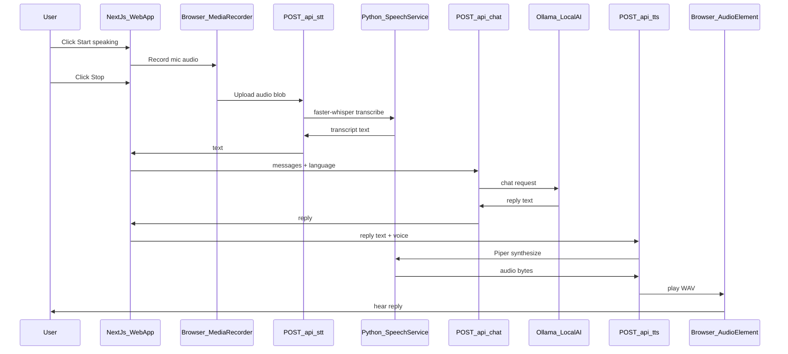

# Phase 2: Local Open-Source STT & TTS (No Browser Speech APIs)

> Saved plan for the Voice Customer Support System — Phase 2  
> Requirements: upgrade from [phase-1-plan.md](../phase-1-plan.md)

## Goal

Upgrade the Voice Customer Support System from Phase 1 (browser `SpeechRecognition` + `speechSynthesis`) to **server-side open-source speech**, while keeping the same web UI and Ollama LLM.

**Phase 2 delivers:**

- Mic capture and audio playback still in the browser (unavoidable for a web app)
- **STT and TTS processing moved off the browser** to local open-source engines
- Works in **any modern browser** (no Chrome-only speech recognition)
- Fully **free and local** — no Google/Azure/AWS keys

---

## What changes vs Phase 1

| Layer | Phase 1 | Phase 2 |
|-------|---------|---------|
| Mic access | Browser `getUserMedia` | Same |
| STT | Browser Web Speech API | **faster-whisper** (server) |
| LLM | Ollama `llama3.2` | Same (unchanged) |
| TTS | Browser `speechSynthesis` | **Piper** (server) |
| Audio playback | Browser TTS | Browser `<audio>` plays WAV/MP3 from server |
| Browser requirement | Chrome/Edge only | Any browser with mic support |

**Removed from critical path:** `lib/speechRecognition.ts`, `lib/speechSynthesis.ts`, `lib/speechVoices.ts` (keep behind feature flag or delete after migration).

---

## Recommended architecture

After comparing options, **recommended setup: Python sidecar on your Mac** (not Docker for Phase 2).



### Tool choices

#### STT: **faster-whisper** (recommended)

| Pros | Cons |
|------|------|
| Open source (Whisper weights) | Requires Python + ~1–2 GB model download |
| Strong accuracy, many languages | First transcription slower (model load) |
| Runs fully offline on Mac (CPU or Metal) | Heavier than tiny Vosk |
| Active community, easy Python API | Separate process from Next.js |

**Alternatives considered:**

- **Vosk** — lighter/faster, but lower accuracy; good only if speed matters more than quality
- **whisper.cpp** — fast C++ port, but more glue code; better if you later need embedded/C deployment

**Default model:** `base` or `small` (good balance on M4 Pro; use `tiny` only if too slow)

#### TTS: **Piper** (recommended)

| Pros | Cons |
|------|------|
| Open source, fully offline | Voice quality good but not “studio” level |
| Very fast on CPU | Must download voice `.onnx` files per language |
| Small footprint vs Coqui XTTS | Fewer voice personas than cloud TTS |
| Returns WAV/MP3 bytes easily | No real-time streaming in v1 (batch is fine) |

**Alternatives considered:**

- **Coqui XTTS** — higher quality, much heavier GPU/RAM
- **MeloTTS** — decent quality, less mature Piper ecosystem

#### Service packaging: **Python FastAPI sidecar** (recommended)

| Pros | Cons |
|------|------|
| Simplest path for Whisper + Piper | Two runtimes: Node + Python |
| Matches how most local-AI projects work | One extra terminal to start |
| Easy to test with `curl` | Needs `pip` / `venv` setup once |

**Docker Compose (deferred):** better for team deploy/reproducibility, but adds Docker learning curve — optional Phase 2.1.

---

## New project layout

```
voice_customer_support_system/
├── plan/
│   └── phase-2-plan.md             # this file
├── phase-1-plan.md
├── speech-service/                 # NEW — Python sidecar
│   ├── README.md
│   ├── requirements.txt            # fastapi, uvicorn, faster-whisper, piper-tts
│   ├── main.py                     # FastAPI app
│   ├── stt.py                      # faster-whisper wrapper
│   ├── tts.py                      # Piper wrapper
│   └── models/                     # gitignored — downloaded voices/weights
├── app/
│   └── api/
│       ├── chat/route.ts           # unchanged (Ollama)
│       ├── stt/route.ts            # NEW — proxy audio → speech-service
│       └── tts/route.ts            # NEW — proxy text → speech-service
├── lib/
│   ├── audioCapture.ts             # NEW — MediaRecorder wrapper
│   ├── audioPlayback.ts            # NEW — play blob URL / ArrayBuffer
│   ├── speechClient.ts             # NEW — fetch /api/stt and /api/tts
│   └── constants.ts                # add SPEECH_SERVICE_URL, STT/TTS defaults
├── hooks/
│   └── useVoiceSession.ts          # refactor: record → STT → chat → TTS → play
├── e2e/
│   └── app.spec.ts                 # update mocks for MediaRecorder + /api/stt|tts
└── .env.example                    # SPEECH_SERVICE_URL, WHISPER_MODEL, PIPER_VOICE
```

---

## API design

### `POST /api/stt` (Next.js → Python)

- **Request:** `multipart/form-data` with `audio` (webm/wav from MediaRecorder) + `language` (`en-US`, `hi-IN`)
- **Response:** `{ transcript: string }`
- **Errors:** empty audio, speech service down, model missing

### `POST /api/tts` (Next.js → Python)

- **Request:** `{ text: string, language?: string, voice?: string }`
- **Response:** `audio/wav` binary (or `{ audioBase64 }` if simpler for client)
- **Errors:** empty text, voice not found

### Python speech-service (localhost:8000)

| Endpoint | Role |
|----------|------|
| `GET /health` | Returns `{ ok: true, stt: "ready", tts: "ready" }` |
| `POST /stt` | Run faster-whisper on uploaded audio |
| `POST /tts` | Run Piper, return WAV |

Next.js never calls Python directly from the browser — only via `/api/stt` and `/api/tts` (same pattern as Ollama proxy).

---

## UI / session flow (keep Phase 1 UX)

Retain existing controls from `app/page.tsx`:

- **Start conversation** → mic permission
- **Start speaking** → begin `MediaRecorder`
- **Stop** → stop recording, upload to STT, continue pipeline
- **Stop reply** → abort fetch + stop audio playback
- **Settings** → language stays; replace browser voice picker with **Piper voice** dropdown

Status machine unchanged: `idle → listening → thinking → speaking → idle`

---

## Hook refactor (`useVoiceSession.ts`)

Replace STT/TTS calls:

1. `startListening()` → start MediaRecorder, show live “recording” state
2. `stopListening()` → stop recorder, get `Blob`, POST `/api/stt`
3. On transcript → existing `sendToAgent()` → Ollama via `/api/chat`
4. On reply → POST `/api/tts`, receive audio, play via `audioPlayback.ts`
5. `stopReply()` → abort STT/chat/TTS fetches + `HTMLAudioElement.pause()`

Remove dependency on `isSpeechRecognitionSupported()` for session start — only check `getUserMedia` + speech-service health.

---

## Setup (beginner-friendly)

### One-time installs

**Terminal 1 — Ollama** (unchanged):

```bash
ollama serve
ollama pull llama3.2
```

**Terminal 2 — Python speech service** (new):

```bash
cd voice_customer_support_system/speech-service
python3 -m venv .venv
source .venv/bin/activate
pip install -r requirements.txt
python download_models.py   # pulls Whisper + Piper voice files
uvicorn main:app --port 8000
```

**Terminal 3 — Next.js** (unchanged):

```bash
cd voice_customer_support_system
npm install
npm run dev
```

### Environment variables (`.env.example`)

```
OLLAMA_MODEL=llama3.2
OLLAMA_BASE_URL=http://localhost:11434
SPEECH_SERVICE_URL=http://localhost:8000
WHISPER_MODEL=base
PIPER_VOICE=en_US-lessac-medium
```

---

## Error handling (new cases)

| Error | User message |
|-------|----------------|
| Speech service down | "Speech engine not running. Start the speech service (see README)." |
| Whisper model missing | "STT model not downloaded. Run speech-service setup." |
| Piper voice missing | "TTS voice not found. Check Settings voice or run download_models.py." |
| Empty recording | "No audio captured. Check mic and try again." |
| Ollama down | Existing Phase 1 message (unchanged) |

Add **health check on session start**: `GET /api/health` aggregates Ollama + speech-service status.

---

## Testing (required)

Update Playwright tests in `e2e/`:

- Mock `MediaRecorder` to return a fake audio blob
- Mock `/api/stt` → `{ transcript: "..." }`
- Mock `/api/tts` → return minimal WAV bytes
- Keep existing chat + stop-reply tests

Run after every change:

```bash
npm run test:e2e
```

Add Python smoke tests for speech-service (`pytest` or simple `curl` script in `speech-service/tests/`).

---

## Acceptance criteria

- [x] App runs with **3 services**: Ollama, speech-service, Next.js
- [x] STT does **not** use `SpeechRecognition` / `webkitSpeechRecognition`
- [x] TTS does **not** use `speechSynthesis`
- [ ] User speech appears in transcript after clicking Stop
- [ ] Ollama reply is spoken via server-generated audio
- [ ] Works in **Firefox or Safari** (mic + playback), not Chrome-only
- [ ] English (`en-US`) and Hindi (`hi-IN`) supported
- [ ] Clear errors when speech-service is stopped
- [ ] Playwright e2e passes
- [ ] README updated with Phase 2 setup steps

---

## Implementation order

1. Scaffold `speech-service/` (FastAPI, health, STT, TTS, model download script)
2. Add Next.js proxy routes `/api/stt`, `/api/tts`, `/api/health`
3. Add `lib/audioCapture.ts` + `lib/audioPlayback.ts` + `lib/speechClient.ts`
4. Refactor `useVoiceSession.ts` to new pipeline
5. Update Settings (Piper voice list) and remove browser voice picker
6. Update README + `.env.example` + TROUBLESHOOTING
7. Update Playwright e2e + add speech-service smoke tests

---

## Implementation todos

- [ ] Create `speech-service/` FastAPI app with faster-whisper STT, Piper TTS, health endpoint, and `download_models.py`
- [ ] Add `/api/stt`, `/api/tts`, `/api/health` proxy routes in Next.js
- [ ] Add `audioCapture.ts`, `audioPlayback.ts`, `speechClient.ts` for MediaRecorder + audio playback
- [ ] Refactor `useVoiceSession.ts` to record → STT → chat → TTS → play (remove Web Speech API)
- [ ] Update Settings for Piper voices; update hints/errors for speech-service
- [ ] Update README, `.env.example`, TROUBLESHOOTING
- [ ] Update e2e tests to mock MediaRecorder and `/api/stt|tts`; add speech-service smoke tests

---

## Out of scope for Phase 2

- Cloud STT/TTS (Google, Azure, Polly)
- NLP frameworks (spaCy, Rasa, CoreNLP) — defer to Phase 3
- Auto silence detection / VAD (optional stretch; manual Start/Stop remains)
- Phone/telephony, knowledge base, CRM integration
- Docker production deploy (optional follow-up)

---

## Risks and mitigations

| Risk | Mitigation |
|------|------------|
| Python setup friction | `speech-service/README.md` with copy-paste commands; `download_models.py` |
| Large model downloads | Document sizes upfront; default to `base` Whisper + one Piper voice |
| Latency (STT + LLM + TTS) | Show status labels; allow Stop reply; consider `tiny` Whisper if needed |
| Two-folder project confusion | Use `voice_customer_support_system/` as canonical root; fix README paths |

---

## Future phases (not built in Phase 2)

| Phase | Adds |
|-------|------|
| 3 | NLP (spaCy/Rasa), knowledge base, simple tools |
| 4 | Phone calls (Twilio/Exotel), human handoff |
