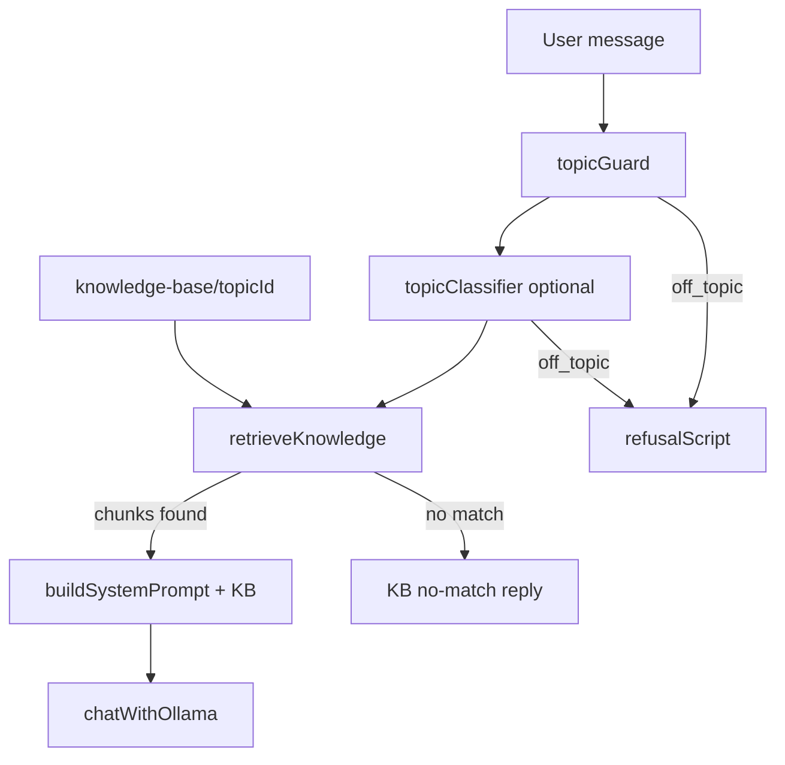

# Phase 3: Topic-Scoped Voice Support

> Saved plan — implemented in the Voice Customer Support System

## Goal

User selects a **support topic** from a dropdown (Settings) before starting a call. The assistant answers **only** in-scope questions, uses **topic knowledge-base files** as the sole source of facts, and refuses off-topic questions with a short spoken script.

## Topics

| ID | Label |
|----|--------|
| `hotel` | Hotel management — customer support |
| `cooking` | Cooking support (recipes, spices, ingredients, techniques) |
| `retail` | Retail / e-commerce support |
| `travel` | Travel & airline support |
| `banking` | Banking support (demo) |
| `it_helpdesk` | IT helpdesk support |

## Knowledge base (file-based RAG)

Answers for in-scope questions come **only** from markdown files under `knowledge-base/{topicId}/`.

```text
knowledge-base/
  {topicId}/
    overview.md    — what this line helps with (any in-topic question)
    guide.md       — general steps when FAQ does not list the case
    *.md           — topic-specific FAQs (faqs, orders, flights, etc.)
```

All six topics follow the same layout as cooking: `hotel`, `cooking`, `retail`, `travel`, `banking`, `it_helpdesk`.

- Edit these files to change what the assistant can say for each topic.
- Files use `##` section headings; each section becomes a retrievable chunk.
- Dummy demo content only — not real business data.

### Retrieval (`lib/knowledgeBase.ts`)

1. Load all `.md` files for the selected `topicId` (cached in memory).
2. Split into chunks by `##` headings.
3. Score chunks by keyword overlap with the user question.
4. Inject top 4 matching chunks into the system prompt.

**Open topics (all six):** any in-scope question is answered (any phrasing). All non-meta files under that topic folder are retrieved as reference; if nothing matches, Ollama uses normal domain knowledge for that support line. Off-topic questions are still refused by the topic guard.

## Enforcement pipeline



1. **Keyword guard** (`lib/topicGuard.ts`) — cross-domain keywords → instant refusal
2. **Classifier** (`lib/topicClassifier.ts`) — optional `ON_TOPIC` / `OFF_TOPIC` when ambiguous (`TOPIC_STRICT_MODE`, default on)
3. **Knowledge retrieval** — keyword chunk match from topic folder
4. **Topic system prompt** — open-answer mode (KB as reference) + voice formatting (`buildSystemPrompt`)

Orchestrated in `lib/chatPipeline.ts` via `POST /api/chat`.

## UX (Phase 3)

- Support topic dropdown in Settings (locked during active session)
- Status bar shows topic + state (e.g. “Cooking support · Listening”)
- Phase 4+: topic cards landing, URL deep links, IVR

## Configuration

```bash
TOPIC_STRICT_MODE=true   # classifier when guard is ambiguous
```

## Testing

```bash
npm run test:e2e
```

Manual examples:

- Hotel + “What time is check-in?” → answer from `knowledge-base/hotel/faqs.md`
- Cooking + “how to make pav bhaji” → answer grounded on `recipes.md` when matched
- Cooking + “what is turmeric used for” → answer grounded on `spices.md` when matched
- Hotel + “is there a gym” → answer (KB when matched, else general hotel knowledge)
- Retail + “gift card with promo” → answer even if not verbatim in KB
- Travel + “visa requirements” → answer
- IT + “MFA setup” → answer
- Banking + “what is repo rate” → answer (reference `rates.md` when matched)
- Any topic + off-topic question (e.g. hotel check-in on cooking line) → topic refusal (guard)
- Hotel + obscure question not in KB → KB no-match reply

## Phase 4+ (deferred)

- Topic cards landing + `?topic=` URL deep links
- Semantic search (embeddings) over larger knowledge bases
- Spoken greeting per topic
- Sample question chips on topic picker
