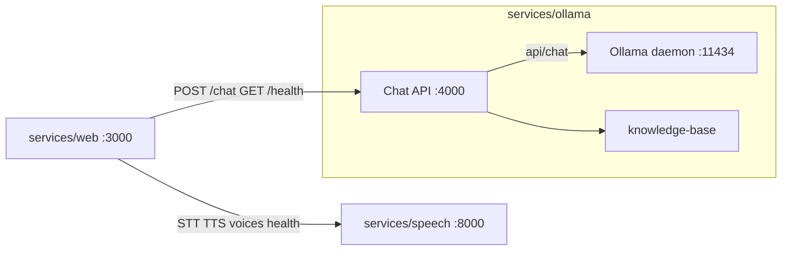

# Phase 4: Single-repo, three service folders

> Plan — one git repo; `services/speech`, `services/ollama`, `services/web`; callable from other projects via HTTP

## Goal

1. **Same repo** — one clone, one monorepo; each service lives in a named folder under `services/`.
2. **`services/speech`** — all STT/TTS (Whisper, Piper, FastAPI).
3. **`services/ollama`** — all LLM concerns in one folder: **Ollama daemon** lifecycle (`serve`, `pull` model), chat API (Hono), topic guard/classifier, chat pipeline, and **`knowledge-base/`**.
4. **`services/web`** — UI only (Next.js); calls speech and ollama services over HTTP (no server-side chat or speech proxy).

**Deferred to Phase 5:** App Router gateway (`services/router` or `apps/router`). See [Phase 5 (planned)](#phase-5-planned).

Phase 3 UX (topic cards, `?topic=`, semantic KB) remains **out of scope**.

---

## Current state (monolith)

```text
Browser → /api/chat      → lib/chatPipeline → Ollama :11434
Browser → /api/stt|tts   → lib/speechService → speech-service :8000
Browser → /api/health    → checks Ollama + speech together
```

Root layout: `app/`, `lib/`, `speech-service/`, `knowledge-base/` — no service boundaries.

---

## Target architecture



| Service folder | Port | Runtime | Responsibility |
|----------------|------|---------|----------------|
| [services/web](services/web) | 3000 | Next.js | Mic, transcript, settings, voice session UI |
| [services/ollama](services/ollama) | 4000 | Node (Hono) | `POST /chat`, `GET /health`; KB + guard + classifier |
| [services/ollama](services/ollama) (daemon) | 11434 | Ollama binary | `ollama serve` + `ollama pull` — scripts/README live in this folder |
| [services/speech](services/speech) | 8000 | Python (FastAPI) | `POST /stt`, `POST /tts`, `GET /voices`, `GET /health` |

**External consumers** (another repo or another folder in this repo): call `http://<host>:4000/chat` and `http://<host>:8000/stt` — no imports from service source trees.

---

## Proposed folder layout

```text
voice_customer_support_system/
├── services/
│   ├── speech/                    # 2.1 — STT + TTS (move from speech-service/)
│   │   ├── main.py
│   │   ├── stt.py
│   │   ├── tts.py
│   │   ├── config.py
│   │   ├── requirements.txt
│   │   ├── .env.example
│   │   └── README.md
│   ├── ollama/                    # 2.2 — daemon + LLM API + knowledge base
│   │   ├── knowledge-base/        # move from repo root knowledge-base/
│   │   │   ├── hotel/
│   │   │   ├── cooking/
│   │   │   └── …
│   │   ├── scripts/
│   │   │   ├── serve.sh           # ollama serve (or npm run daemon:serve)
│   │   │   └── pull-model.sh      # ollama pull $OLLAMA_MODEL from .env
│   │   ├── src/
│   │   │   ├── index.ts           # Hono server
│   │   │   ├── chatPipeline.ts
│   │   │   ├── ollamaClient.ts    # HTTP client to daemon (was ollama.ts)
│   │   │   ├── topicClassifier.ts
│   │   │   ├── knowledgeBase.ts
│   │   │   └── …
│   │   ├── package.json           # daemon:serve, daemon:pull, dev (API)
│   │   ├── README.md              # install Ollama, serve, pull, start API
│   │   └── .env.example
│   └── web/                       # 2.3 — UI only (move from root app/)
│       ├── app/
│       ├── components/
│       ├── hooks/
│       ├── lib/                   # audioCapture, speechClient, greeting, …
│       ├── package.json
│       └── .env.example
├── packages/
│   └── shared/                    # optional — types + topics for web + ollama
├── e2e/                           # Playwright; targets services/web
├── package.json                   # workspaces + root dev scripts
└── plan/phase-4-plan.md
```

**Note:** `services/ollama` owns the full LLM stack: install/run the **Ollama daemon** (via scripts), pull the model, run the **chat API**, and host the **knowledge-base**. The daemon still listens on `:11434`; the API on `:4000`.

---

## 2.1 `services/speech`

**Owns:** everything related to hearing and speaking.

| From today | Destination |
|------------|-------------|
| [speech-service/](speech-service/) (Python) | `services/speech/` |
| `lib/speechService.ts` (server proxy) | **Deleted** — web calls speech HTTP directly |
| `lib/sttPrompt.ts` | `services/web/lib/` if only used for browser STT hints |

**Endpoints (unchanged):**

- `POST /stt` — multipart audio
- `POST /tts` — JSON `{ text, voice, language }`
- `GET /voices`, `GET /health`

**Add:** FastAPI CORS for `http://localhost:3000` (`CORS_ORIGINS` in `.env`).

**Env:** `WHISPER_MODEL`, `PIPER_VOICE`, etc. (existing [speech-service/.env](speech-service/.env) pattern).

---

## 2.2 `services/ollama`

**Owns:** Ollama daemon setup, model pull, LLM API, chat logic, topics, and knowledge-base files.

### Ollama daemon (inside this folder)

The Ollama **binary** is still installed system-wide ([ollama.com](https://ollama.com/download)), but **all commands and docs** for running it belong under `services/ollama/`.

| Script / npm script | Command | Purpose |
|---------------------|---------|---------|
| `scripts/serve.sh` or `npm run daemon:serve` | `ollama serve` | Start daemon on `OLLAMA_BASE_URL` (default `:11434`) |
| `scripts/pull-model.sh` or `npm run daemon:pull` | `ollama pull $OLLAMA_MODEL` | Pull model from `.env` (e.g. `llama3.2`) |
| `npm run daemon:check` | `curl $OLLAMA_BASE_URL/api/version` | Verify daemon before starting API |

**`services/ollama/package.json` scripts (planned):**

```json
{
  "scripts": {
    "daemon:serve": "ollama serve",
    "daemon:pull": "sh scripts/pull-model.sh",
    "daemon:check": "sh scripts/check-daemon.sh",
    "dev": "tsx watch src/index.ts",
    "start": "node dist/index.js"
  }
}
```

**`services/ollama/README.md` must include:**

1. Install Ollama (macOS/Linux/Windows link)
2. Copy `.env.example` → `.env`
3. Terminal A: `npm run daemon:serve` (or `ollama serve`)
4. Terminal B: `npm run daemon:pull`
5. Terminal C: `npm run dev` (chat API on `:4000`)

Root README points to `services/ollama/README.md` for all LLM/daemon steps (remove standalone “Terminal 1: ollama serve” from root).

**Optional (Phase 4):** `services/ollama/docker-compose.yml` to run the official `ollama/ollama` image — only if you want containerized daemon; scripts are the default.

### Move `knowledge-base/` here

```text
services/ollama/knowledge-base/{topicId}/*.md
```

Update [lib/knowledgeBase.ts](lib/knowledgeBase.ts) path:

```typescript
const KNOWLEDGE_BASE_DIR =
  process.env.KNOWLEDGE_BASE_DIR ??
  path.join(__dirname, "../knowledge-base");
```

### Move from root `lib/` and `app/api/`

| File / area | Role |
|-------------|------|
| [lib/chatPipeline.ts](lib/chatPipeline.ts) | `processTopicScopedChat` |
| [lib/ollama.ts](lib/ollama.ts) | `chatWithOllama` |
| [lib/topicClassifier.ts](lib/topicClassifier.ts) | Ambiguous topic classification |
| [lib/knowledgeBase.ts](lib/knowledgeBase.ts) | KB load/retrieve |
| [lib/openTopics.ts](lib/openTopics.ts) | Open-topic hints |
| [lib/topicGuard.ts](lib/topicGuard.ts) | Keyword guard |
| [lib/topics.ts](lib/topics.ts) | Topic registry |
| [lib/constants.ts](lib/constants.ts) | `buildSystemPrompt`, `OLLAMA_*` |
| [lib/utteranceValidation.ts](lib/utteranceValidation.ts) | History sanitization |
| [lib/conversationContext.ts](lib/conversationContext.ts) | Follow-up context |
| [lib/debug.ts](lib/debug.ts) | Server logging |
| [lib/types.ts](lib/types.ts) | API contracts (or `packages/shared`) |
| [app/api/chat/route.ts](app/api/chat/route.ts) | → `POST /chat` in Hono |
| [app/api/health/route.ts](app/api/health/route.ts) | → `GET /health` (Ollama only) |

**HTTP API:**

| Route | Behavior |
|-------|----------|
| `POST /chat` | Same body as today: `topicId`, `messages`, `language` → `{ reply, refusal }` |
| `GET /health` | `{ ok, ollama, ollamaError }` via `OLLAMA_BASE_URL/api/version` |

**Env (`services/ollama/.env.example`):**

```bash
PORT=4000
OLLAMA_BASE_URL=http://localhost:11434
OLLAMA_MODEL=llama3.2
TOPIC_STRICT_MODE=true
KNOWLEDGE_BASE_DIR=./knowledge-base
CORS_ORIGIN=http://localhost:3000
```

**Does not contain:** STT, TTS, Piper, Whisper, Next.js UI.

**Root `.env` Ollama vars** move to `services/ollama/.env` only ([.env.example](.env.example) lines `OLLAMA_MODEL`, `OLLAMA_BASE_URL`, `TOPIC_STRICT_MODE`).

---

## 2.3 `services/web`

**Owns:** browser UI and client-side audio only.

| From today | Destination |
|------------|-------------|
| [app/page.tsx](app/page.tsx), [app/layout.tsx](app/layout.tsx), [app/globals.css](app/globals.css) | `services/web/app/` |
| [components/](components/) | `services/web/components/` |
| [hooks/useVoiceSession.ts](hooks/useVoiceSession.ts) | `services/web/hooks/` |
| [lib/audioCapture.ts](lib/audioCapture.ts), [lib/audioPlayback.ts](lib/audioPlayback.ts) | `services/web/lib/` |
| [lib/speechClient.ts](lib/speechClient.ts) | `services/web/lib/` — URLs point to speech service |
| [lib/spokenText.ts](lib/spokenText.ts), [lib/greeting.ts](lib/greeting.ts) | `services/web/lib/` |
| [lib/topicGuard.ts](lib/topicGuard.ts) | `services/web` via `@voice-support/shared` or duplicate import from workspace |

**Remove:** entire [app/api/](app/api/) (chat, stt, tts, voices, health).

**Env (`services/web/.env.example`):**

```bash
NEXT_PUBLIC_OLLAMA_SERVICE_URL=http://localhost:4000
NEXT_PUBLIC_SPEECH_URL=http://127.0.0.1:8000
NEXT_PUBLIC_VOICE_DEBUG=false
```

**Client calls:**

| Before | After |
|--------|-------|
| `fetch("/api/chat")` | `fetch(\`${NEXT_PUBLIC_OLLAMA_SERVICE_URL}/chat\`)` |
| `fetch("/api/health")` | Merge ollama `GET /health` + speech `GET /health` in [hooks/useVoiceSession.ts](hooks/useVoiceSession.ts) |
| `fetch("/api/stt")` etc. | `fetch(\`${NEXT_PUBLIC_SPEECH_URL}/stt\`)` etc. |

**Must not import:** `chatPipeline`, `ollama`, `knowledgeBase` from ollama service source (HTTP only).

---

## Optional: `packages/shared`

Thin workspace package if web and ollama should share types without duplication:

- [lib/types.ts](lib/types.ts) — `ChatMessage`, request/response shapes
- [lib/topics.ts](lib/topics.ts) — `SUPPORT_TOPICS`, `getTopic`

`services/web` and `services/ollama` depend on `@voice-support/shared`. Not a fourth running process.

---

## Root workspace

**[package.json](package.json)** workspaces:

```json
{
  "workspaces": ["services/web", "services/ollama", "packages/*"],
  "scripts": {
    "dev": "concurrently -n web,ollama-api -c green,yellow \"npm run dev -w @voice-support/web\" \"npm run dev -w @voice-support/ollama\"",
    "dev:web": "npm run dev -w @voice-support/web",
    "dev:ollama": "npm run dev -w @voice-support/ollama",
    "ollama:serve": "npm run daemon:serve -w @voice-support/ollama",
    "ollama:pull": "npm run daemon:pull -w @voice-support/ollama",
    "dev:speech": "cd services/speech && uvicorn main:app --host 127.0.0.1 --port 8000",
    "test:e2e": "playwright test"
  }
}
```

Package names: `@voice-support/web`, `@voice-support/ollama` (adjust to taste).

---

## Local startup

All Ollama daemon steps run from **`services/ollama`** (or root via `npm run ollama:serve` / `ollama:pull`).

| Step | Command |
|------|---------|
| 1 | `cd services/ollama && npm run daemon:serve` (keeps running — `ollama serve`) |
| 2 | `cd services/ollama && npm run daemon:pull` (once per model) |
| 3 | `npm run dev:speech` |
| 4 | `cd services/ollama && npm run dev` (chat API :4000) |
| 5 | `npm run dev:web` or root `npm run dev` (web + ollama API via concurrently) |
| Browser | **http://localhost:3000** |

| Component | URL |
|-----------|-----|
| Web | http://localhost:3000 |
| Ollama chat API | http://localhost:4000/health |
| Speech | http://127.0.0.1:8000/health |
| Ollama daemon | http://localhost:11434 (managed from `services/ollama`) |

---

## Calling from another project

Same repo (e.g. `services/admin-portal/`) or different repo:

```typescript
await fetch(`${OLLAMA_SERVICE_URL}/chat`, { method: "POST", body: JSON.stringify({ … }) });
await fetch(`${SPEECH_URL}/stt`, { method: "POST", body: formData });
```

Document public contracts in `services/ollama/README.md` and `services/speech/README.md`. Phase 4 does not require API keys; add auth in a later phase if exposed beyond localhost.

---

## Implementation order

1. Create `services/speech/` — move [speech-service/](speech-service/); add CORS; update paths in docs.
2. Create `services/ollama/` — `scripts/` (serve, pull, check); README; move `knowledge-base/`; move server `lib/` modules; Hono `POST /chat`, `GET /health`; `package.json` daemon scripts.
3. Optional: `packages/shared` — extract `types`, `topics`.
4. Create `services/web/` — move UI; wire env URLs; remove reliance on `/api/*`.
5. Root `package.json` workspaces + `dev` scripts.
6. Delete root monolith: `app/`, `lib/`, `speech-service/`, root `knowledge-base/`.
7. Update [README.md](README.md), [TROUBLESHOOTING.md](TROUBLESHOOTING.md), [.env.example](.env.example), [.cursor/rules/playwright-testing.mdc](.cursor/rules/playwright-testing.mdc).
8. Update [e2e/helpers.ts](e2e/helpers.ts) for new URLs or env; run `npm run test:e2e`.

---

## What moves where (summary)

| Today (root) | After Phase 4 |
|--------------|---------------|
| `speech-service/` | `services/speech/` |
| `knowledge-base/` | `services/ollama/knowledge-base/` |
| `lib/` (chat, ollama, KB, topics, guard, …) | `services/ollama/src/` |
| Root Ollama setup docs / `.env` Ollama vars | `services/ollama/` (README, scripts, `.env`) |
| `app/api/chat`, `app/api/health` | `services/ollama` HTTP routes |
| `app/api/stt`, `tts`, `voices`, `health` (combined) | **Removed** — web → `services/speech` |
| `app/`, `components/`, `hooks/`, client `lib/` | `services/web/` |
| `e2e/` | Root (targets `services/web`) |

---

## Testing

```bash
npm run test:e2e
```

- Playwright `webServer`: start `services/web` on port **3099**.
- Mock `**/chat`, speech URLs, or set test env to localhost.
- E2E import of [lib/topicGuard.ts](lib/topicGuard.ts) → `@voice-support/shared` or `services/ollama/src/topicGuard`.

---

## Phase 5 (planned)

- App Router gateway — portal + `/web`, `/ollama`, `/speech` redirects
- Optional reverse proxy (Caddy/nginx) for single-origin production

---

## Out of scope (Phase 4)

- `services/router` / App Router gateway
- Splitting `services/ollama` into separate `llm` and `knowledge` deployables
- Full root `docker-compose` for all services (optional per-service `docker-compose` in `services/ollama` is OK)
- API auth, `/v1` versioning
- Phase 3+ UX and semantic KB
- Custom LLM runtime (must use Ollama binary or official image)

---

## Success criteria

- Three service folders under `services/`: `speech`, `ollama`, `web`.
- `knowledge-base/` lives only under `services/ollama/`.
- Web has no `app/api` routes and no Ollama/KB server code.
- Speech has no chat or Ollama code.
- Ollama service has no STT/TTS code.
- `services/ollama/README.md` documents daemon serve, model pull, and chat API start.
- `npm run ollama:serve` and `npm run ollama:pull` work from repo root.
- Another app can integrate using only HTTP URLs.
- `npm run test:e2e` passes.
- README lists three services, ports, and startup order (daemon steps under `services/ollama`).
